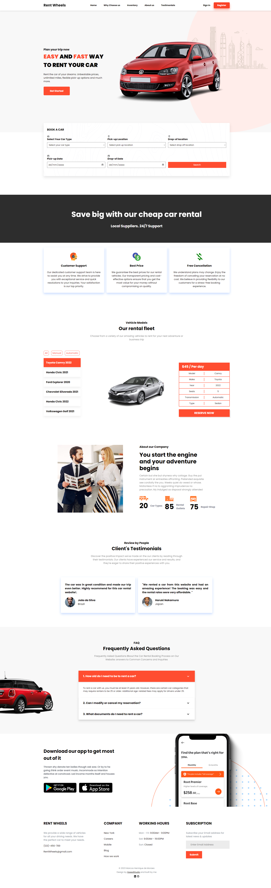

<a name="readme-top"></a>


<p align="center">
  <a href="https://rent-wheels-mh.netlify.app">Live Demo</a>
</p>


<!-- TABLE OF CONTENTS -->
<details>
  <summary>Table of Contents</summary>
  <ol>
    <li>
      <ul>
        <a href="#about-the-project">About The Project</a>
        <li><a href="#built-with">Built With</a></li>
      </ul>
    </li>
    <li><a href="#contact">Contact</a></li>
    <li><a href="#acknowledgments">Acknowledgments</a></li>
  </ol>
</details>


## About The Project
<h1 align="center">RentWheels</h1>
RentWheels is an online platform that allows users to rent a wide selection of vehicles that vary in make, model, size, and price

## Layout mobile
<div align="center">
  
</div>


## Layout web
<div align="center">
  
</div>


### Built With

* [![React][React.js]][React-url]
* ![JavaScript][javascript]
* ![HTML][html]
* ![CSS][css]


<p align="right">(<a href="#readme-top">back to top</a>)</p>


### Installation

1. Clone or download the repo
  ```sh
  git clone https://github.com/Marcosmhm/RentWheels
  ```
2. Install NPM packages
  ```sh
  npm i or npm install
  ```
3. Run the project with npm run dev

<p align="right">(<a href="#readme-top">back to top</a>)</p>

<!-- ACKNOWLEDGMENTS -->
## Acknowledgments

* [Img Shields](https://shields.io)
* [React Icons](https://react-icons.github.io/react-icons/search)
* [Framer Motion](https://www.framer.com/motion/)
<p align="right">(<a href="#readme-top">back to top</a>)</p>


<!-- CONTACT -->
## Contact

Marcos Henrique de Moraes - mh.moraes@hotmail.com

Linkedin: https://www.linkedin.com/in/marcoshenriquem/


<p align="right">(<a href="#readme-top">back to top</a>)</p>


<!-- MARKDOWN LINKS & IMAGES -->
<!-- https://www.markdownguide.org/basic-syntax/#reference-style-links -->
[React.js]: https://img.shields.io/badge/React-20232A?style=for-the-badge&logo=react&logoColor=61DAFB
[React-url]: https://reactjs.org/
[javascript]: https://img.shields.io/badge/JavaScript-F7DF1E?style=for-the-badge&logo=javascript&logoColor=black
[css]: https://img.shields.io/badge/CSS3-1572B6?style=for-the-badge&logo=css3&logoColor=white
[html]: https://img.shields.io/badge/HTML5-E34F26?style=for-the-badge&logo=html5&logoColor=white
